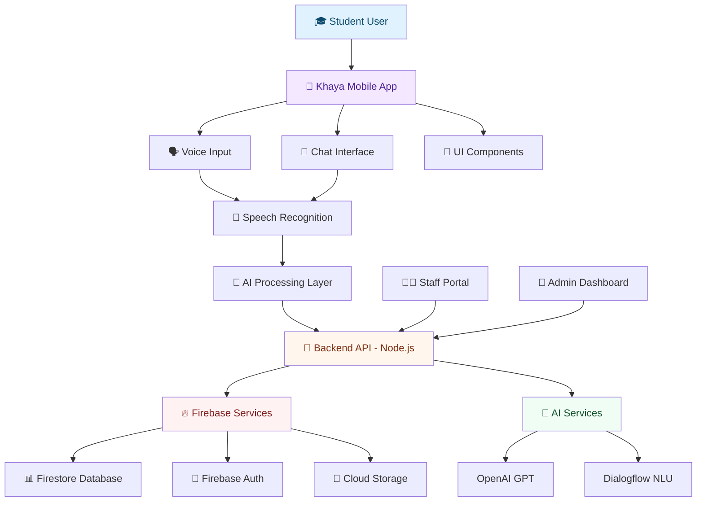

<div align="center">

<!-- Animated Header Banner -->


<!-- Animated Logo / Tagline -->
<br/>

```
██╗  ██╗██╗  ██╗ █████╗ ██╗   ██╗ █████╗
██║ ██╔╝██║  ██║██╔══██╗╚██╗ ██╔╝██╔══██╗
█████╔╝ ███████║███████║ ╚████╔╝ ███████║
██╔═██╗ ██╔══██║██╔══██║  ╚██╔╝  ██╔══██║
██║  ██╗██║  ██║██║  ██║   ██║   ██║  ██║
╚═╝  ╚═╝╚═╝  ╚═╝╚═╝  ╚═╝   ╚═╝   ╚═╝  ╚═╝
```

### ✨ *"Home"* in isiZulu — Your AI-Powered Campus Living Companion ✨

<br/>

<!-- Animated Badges -->
<p>
  
  
  
  
  
  
</p>

<p>
  
  
  
  
  
</p>

<br/>

<!-- Navigation Pills -->
<a href="#-features"></a>
&nbsp;
<a href="#-demo"></a>
&nbsp;
<a href="#-quick-start"></a>
&nbsp;
<a href="#-architecture"></a>

<br/><br/>

</div>

---

## 🌍 Why Khaya?

<div align="center">

> *Campus living, re-imagined through the power of AI.*

</div>

Student residence life shouldn't mean drowning in paperwork, missed announcements, and unreachable staff. **Khaya** replaces all that friction with a single intelligent conversation. Speak. Chat. Done.

<br/>

<table>
  <tr>
    <td align="center">😤 <b>Before Khaya</b></td>
    <td align="center">😊 <b>With Khaya</b></td>
  </tr>
  <tr>
    <td>Filling out paper maintenance forms</td>
    <td>"Hey Khaya, report a broken light in room 12" — done ✅</td>
  </tr>
  <tr>
    <td>Searching notice boards for announcements</td>
    <td>Live push notifications delivered instantly 🔔</td>
  </tr>
  <tr>
    <td>Emailing staff and waiting days</td>
    <td>Direct in-app staff chat with real-time responses 💬</td>
  </tr>
  <tr>
    <td>Hunting for the residence rulebook</td>
    <td>"Khaya, what's the guest policy?" — answered in seconds 📖</td>
  </tr>
  <tr>
    <td>Guessing repair status</td>
    <td>Real-time maintenance tracking dashboard 📊</td>
  </tr>
</table>

<br/>

---

## ✨ Features

<div align="center">

### 🗣️ AI Voice & Chat Assistant

</div>

> Talk to Khaya the way you'd talk to a friend — naturally, quickly, and in your own language.

- 🎤 **Voice-First Design** — Speak naturally; Khaya converts speech to action in seconds
- 🤖 **Powered by GPT** — Deep contextual understanding, not just keyword matching
- 🌐 **Multilingual** — Communicate in English, isiZulu, Afrikaans, and more
- 🕐 **Always On** — 24/7 availability, even at 2 AM during finals

<br/>

<div align="center">

### 🛠️ Smart Maintenance Management

</div>

> From report to repair — tracked every step of the way.

- ⚡ **Instant Reporting** — Voice-to-maintenance-request in under 10 seconds
- 📸 **Photo Attachments** — Add visual context for your maintenance team
- 🔔 **Real-Time Status** — Live progress updates from submission to resolution
- 🧠 **Auto-Fill** — Khaya already knows your room number and history

<br/>

<div align="center">

### 📢 Residence Hub

</div>

> Your one-stop source for everything happening in residence.

- 📣 **Live Announcements** — Important updates pushed directly to you
- 📘 **Digital Rulebook** — Ask Khaya anything about residence policies instantly
- 📅 **Event Calendar** — Never miss inspections, socials, or key deadlines
- 🚨 **Emergency Alerts** — Critical notifications delivered instantly

<br/>

<div align="center">

### 💬 Community & Communication

</div>

> Seamless connections between residents, staff, and management.

- 📩 **Direct Staff Chat** — No more lost emails; real-time messaging built in
- 🤝 **Roommate Coordination** — Shared to-do lists and schedules
- 🏘️ **Community Board** — Connect with fellow residents
- 🔒 **Anonymous Feedback** — Share concerns privately and safely

<br/>

---

## 🎥 Demo

<div align="center">

### 📸 App Screenshots

<br/>

| 🏠 Dashboard | 💬 Chat Interface |
|:---:|:---:|
|  |  |

| 🔧 Maintenance | 📢 Announcements |
|:---:|:---:|
|  |  |

| ⚙️ Settings | 👤 Profile |
|:---:|:---:|
|  |  |

</div>

<br/>

---

## 🏗️ Architecture


```mermaid
graph TD
    A[🎓 Student User] --> B[📱 Khaya Mobile App]
    B --> C[🗣️ Voice Input]
    B --> D[💬 Chat Interface]
    B --> E[📱 UI Components]

    C --> F[🎤 Speech Recognition]
    D --> F
    F --> G[🤖 AI Processing Layer]

    G --> H[🚀 Backend API - Node.js]
    H --> I[🔥 Firebase Services]

    I --> J[📊 Firestore Database]
    I --> K[🔐 Firebase Auth]
    I --> L[📁 Cloud Storage]

    H --> M[🧠 AI Services]
    M --> N[OpenAI GPT]
    M --> O[Dialogflow NLU]

    P[👨‍🏫 Staff Portal] --> H
    Q[👑 Admin Dashboard] --> H

    style A fill:#e0f2fe,color:#0c4a6e
    style B fill:#f3e8ff,color:#4a1d96
    style H fill:#fff7ed,color:#7c2d12
    style I fill:#fef2f2,color:#7f1d1d
    style M fill:#f0fdf4,color:#14532d
```

<br/>

---

## 🚀 Quick Start

### 📋 Prerequisites

Before you begin, ensure you have the following installed:

```
✅ Node.js 16+
✅ npm or yarn
✅ Expo CLI (global)
✅ iOS Simulator (macOS) or Android Studio Emulator
✅ A physical device with Expo Go app (optional)
```

<br/>

### ⚙️ Installation

**1. Clone the Repository**

```bash
git clone https://github.com/your-username/khaya-app.git
cd khaya-app
```

**2. Install Dependencies**

```bash
npm install
# or
yarn install
```

**3. Install Expo CLI Globally**

```bash
npm install -g expo-cli
```

**4. Configure Environment Variables**

```bash
cp .env.example .env
```

Open `.env` and fill in your credentials:

```env
# Firebase Configuration
FIREBASE_API_KEY=your_firebase_api_key
FIREBASE_AUTH_DOMAIN=your_project.firebaseapp.com
FIREBASE_PROJECT_ID=your_project_id
FIREBASE_STORAGE_BUCKET=your_project.appspot.com
FIREBASE_MESSAGING_SENDER_ID=your_sender_id
FIREBASE_APP_ID=your_app_id

# AI Services
OPENAI_API_KEY=your_openai_api_key
DIALOGFLOW_PROJECT_ID=your_dialogflow_project_id

# Backend
API_BASE_URL=http://localhost:3000
```

**5. Start the Development Server**

```bash
npx expo start
```

Then scan the QR code with **Expo Go** on your device, or press:
- `i` → Open iOS Simulator
- `a` → Open Android Emulator
- `w` → Open in Web Browser

<br/>

---

## 📁 Project Structure

```
khaya-app/
│
├── 📱 app/                      # Expo Router screens
│   ├── (auth)/                  # Authentication flows
│   ├── (tabs)/                  # Main tab navigation
│   │   ├── dashboard.tsx        # Home dashboard
│   │   ├── chat.tsx             # AI chat interface
│   │   ├── maintenance.tsx      # Maintenance requests
│   │   ├── announcements.tsx    # Residence announcements
│   │   └── profile.tsx          # User profile & settings
│   └── _layout.tsx              # Root layout
│
├── 🧩 components/               # Reusable UI components
│   ├── ChatBubble.tsx
│   ├── MaintenanceCard.tsx
│   ├── AnnouncementBanner.tsx
│   └── VoiceButton.tsx
│
├── 🧠 services/                 # API & AI service layers
│   ├── ai/
│   │   ├── openai.ts
│   │   └── dialogflow.ts
│   ├── firebase/
│   │   ├── auth.ts
│   │   ├── firestore.ts
│   │   └── storage.ts
│   └── api.ts
│
├── 🗂️ store/                    # State management
│   ├── authStore.ts
│   ├── maintenanceStore.ts
│   └── chatStore.ts
│
├── 🎨 constants/                # Theme, colors, fonts
│   ├── Colors.ts
│   └── Typography.ts
│
├── 🔧 backend/                  # Node.js API server
│   ├── routes/
│   ├── controllers/
│   ├── middleware/
│   └── server.ts
│
├── app.json                     # Expo configuration
├── firebase.config.ts           # Firebase initialization
└── package.json
```

<br/>

---

## 🛣️ Roadmap

```
✅ Phase 1 — Core Foundation
   ✔ AI chat & voice interface
   ✔ Maintenance request system
   ✔ Announcement hub
   ✔ Firebase authentication & database

🔄 Phase 2 — Community Features (In Progress)
   ◉ Roommate coordination tools
   ◉ Anonymous feedback system
   ◉ Community notice board
   ◉ Staff direct messaging

🔮 Phase 3 — Intelligence Layer (Planned)
   ○ Predictive maintenance alerts
   ○ Sentiment analysis on feedback
   ○ Personalized announcements
   ○ Smart scheduling assistant

🌟 Phase 4 — Expansion (Future)
   ○ Multi-campus support
   ○ Integration with university SIS
   ○ AR room navigation
   ○ Offline-first capabilities
```

<br/>

---

## 🤝 Contributing

Contributions are warmly welcomed! Here's how to get started:

1. **Fork** the repository
2. **Create** your feature branch: `git checkout -b feature/amazing-feature`
3. **Commit** your changes: `git commit -m 'feat: add amazing feature'`
4. **Push** to the branch: `git push origin feature/amazing-feature`
5. **Open** a Pull Request

Please read our [Contributing Guidelines](CONTRIBUTING.md) and [Code of Conduct](CODE_OF_CONDUCT.md) before contributing.

<br/>

---

## 📄 License

This project is licensed under the **MIT License** — see the [LICENSE](LICENSE) file for details.

<br/>

---

## 🙏 Acknowledgements

- 🔥 [Firebase](https://firebase.google.com/) — Backend infrastructure
- 🤖 [OpenAI](https://openai.com/) — AI language processing
- ⚡ [Expo](https://expo.dev/) — React Native development platform
- 🎨 [React Native Paper](https://reactnativepaper.com/) — UI components
- 🌍 Inspired by the spirit of **ubuntu** — *"I am because we are"*

<br/>

---

<div align="center">

<!-- Animated Footer -->


<br/>

**Built with ❤️ for students, by students**

*Khaya — because everyone deserves to feel at home.*

<br/>

[](https://github.com/your-username)
&nbsp;&nbsp;
[](https://github.com/your-username/khaya-app)

<br/>

*© 2025 Khaya. All Rights Reserved.*

</div>
