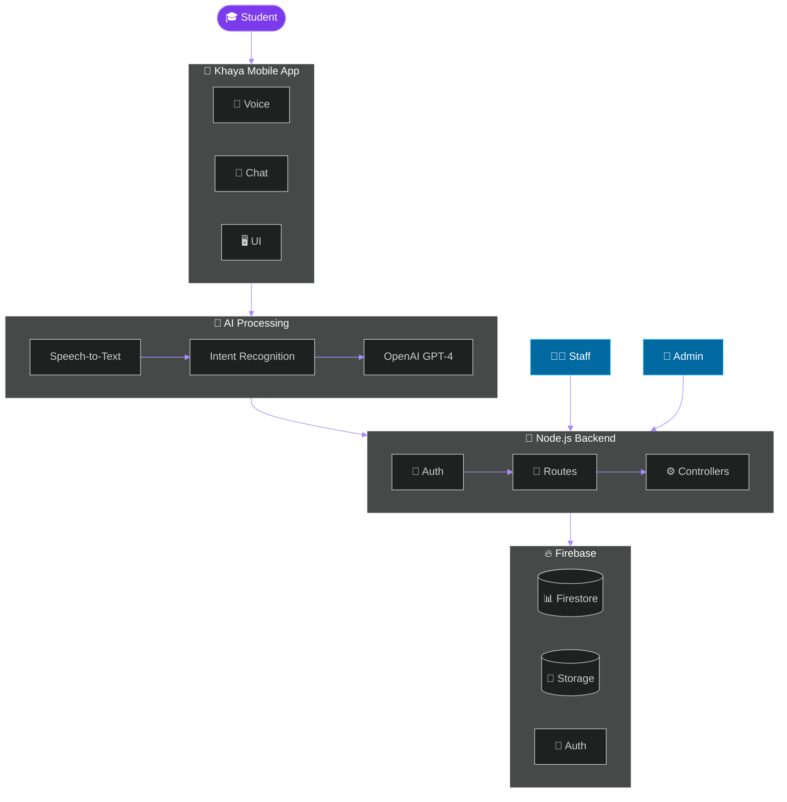

<div align="center">

<!-- HERO ANIMATED GIF BANNER -->


</div>

<div align="center">

<!-- ANIMATED GLOWING TITLE -->


<br/>

<!-- LOOPING TYPEWRITER -->


<br/><br/>

<!-- SKILL ICONS -->


<br/><br/>

<!-- BADGE ROW 1 -->

&nbsp;

&nbsp;


<br/><br/>

<!-- BADGE ROW 2 — TECH STACK -->

&nbsp;

&nbsp;

&nbsp;

&nbsp;

&nbsp;


<br/><br/>

<!-- QUICK NAV -->
[](#-features)
&nbsp;
[](#-screenshots)
&nbsp;
[](#-quick-start)

</div>

---

<br/>

## 🌍 What is Khaya?


**Khaya** *(isiZulu for "Home")* is the campus living upgrade every student deserves.

No paper forms. No email chains. No notice boards.

Open Khaya → Speak or type → Done. ✅

```bash
"Hey Khaya, broken light in room 14B"
  → Ticket created          ✅
  → Staff notified          🔔
  → You track it live       📲
```

> 💜 Built on **Ubuntu** — *"I am because we are"*

<br clear="right"/>

---

<br/>

## ✨ Features

<div align="center">


&nbsp;&nbsp;

&nbsp;&nbsp;


</div>

<br/>

<table>
<tr>
<td width="50%" valign="top">

### 🗣️ AI Voice & Chat


```
🎤  Voice-First Design
🤖  GPT-4 Understanding
🌐  Multilingual Support
🕐  24/7 Availability
💡  Context-Aware AI
```

</td>
<td width="50%" valign="top">

### 🛠️ Smart Maintenance


```
⚡  Report in 10 Seconds
📸  Photo Attachments
🔔  Live Status Tracking
🧠  Auto-fills Room Info
📊  Full Request History
```

</td>
</tr>
<tr>
<td width="50%" valign="top">

### 📢 Residence Hub


```
📣  Live Announcements
📘  Digital Rulebook
📅  Event Calendar
🚨  Emergency Alerts
🗂️  Notice Archive
```

</td>
<td width="50%" valign="top">

### 💬 Community


```
📩  Staff Direct Chat
🤝  Roommate Tools
🏘️  Community Board
🔒  Anonymous Feedback
⭐  Rate Services
```

</td>
</tr>
</table>

---

<br/>

## 🆚 Before vs After Khaya

<div align="center">


```
╔══════════════════════════════════════════════════════════════════════╗
║                                                                      ║
║   😤  WITHOUT KHAYA          |      😊  WITH KHAYA                  ║
║  ────────────────────────────┼───────────────────────────────────── ║
║   Paper maintenance forms    │  Voice request in 10 seconds ✅       ║
║   Searching notice boards    │  Push notifications instantly ✅      ║
║   Emailing staff for days    │  In-app chat, instant replies ✅      ║
║   Guessing repair status     │  Live tracking dashboard ✅           ║
║   Hunting for the rulebook   │  Ask Khaya anything, anytime ✅       ║
║   Missing critical alerts    │  Emergency notifications first ✅     ║
║                                                                      ║
╚══════════════════════════════════════════════════════════════════════╝
```

</div>

---

<br/>

## 📱 Screenshots

<div align="center">


&nbsp;&nbsp;

&nbsp;&nbsp;


<br/><br/>

| 🏠 Dashboard | 💬 AI Chat | 🔧 Maintenance |
|:---:|:---:|:---:|
|  |  |  |

| 📢 Announcements | ⚙️ Settings | 👤 Profile |
|:---:|:---:|:---:|
|  |  |  |

</div>

---

<br/>

## 🏗️ Architecture

<div align="center">

</div>


```mermaid
%%{init: {'theme': 'dark', 'themeVariables': {'primaryColor':'#7c3aed','primaryTextColor':'#fff','primaryBorderColor':'#a78bfa','lineColor':'#a78bfa','secondaryColor':'#1e1b4b','tertiaryColor':'#0f172a'}}}%%
flowchart TD
    U(["🎓 Student"]):::user --> APP

    subgraph APP["📱 Khaya Mobile App"]
        V["🎤 Voice"] & C["💬 Chat"] & UI["🖥️ UI"]
    end

    APP --> AI

    subgraph AI["🧠 AI Processing"]
        STT["Speech-to-Text"] --> NLU["Intent Recognition"] --> GPT["OpenAI GPT-4"]
    end

    AI --> API

    subgraph API["🚀 Node.js Backend"]
        AUTH["🔐 Auth"] --> ROUTES["📡 Routes"] --> CTRL["⚙️ Controllers"]
    end

    API --> DB

    subgraph DB["🔥 Firebase"]
        FS[("📊 Firestore")] & ST[("📁 Storage")] & FK["🔑 Auth"]
    end

    STAFF["👨‍🏫 Staff"]:::ext --> API
    ADMIN["👑 Admin"]:::ext --> API

    classDef user fill:#7c3aed,stroke:#a78bfa,color:#fff
    classDef ext fill:#0369a1,stroke:#38bdf8,color:#fff
```

---

<br/>

## 🚀 Quick Start

<div align="center">


</div>

<br/>

**① Clone the repo**
```bash
git clone https://github.com/your-username/khaya-app.git
cd khaya-app
```

**② Install dependencies**
```bash
npm install
npm install -g expo-cli
```

**③ Set up your environment**
```bash
cp .env.example .env
```
```env
# ── Firebase ──────────────────────────────────────────
FIREBASE_API_KEY=your_firebase_api_key
FIREBASE_AUTH_DOMAIN=yourproject.firebaseapp.com
FIREBASE_PROJECT_ID=your_project_id
FIREBASE_STORAGE_BUCKET=yourproject.appspot.com
FIREBASE_MESSAGING_SENDER_ID=your_sender_id
FIREBASE_APP_ID=your_app_id

# ── AI ────────────────────────────────────────────────
OPENAI_API_KEY=your_openai_api_key
DIALOGFLOW_PROJECT_ID=your_dialogflow_id

# ── Backend ───────────────────────────────────────────
API_BASE_URL=http://localhost:3000
```

**④ Fire it up 🔥**
```bash
npx expo start

# i → iOS Simulator
# a → Android Emulator
# w → Web Browser
```

---

<br/>

## 📁 Project Structure

```
khaya-app/
│
├── 📱 app/
│   ├── (auth)/              🔐 Login • Register • Onboarding
│   ├── (tabs)/
│   │   ├── dashboard.tsx    🏠 Home
│   │   ├── chat.tsx         💬 AI Chat
│   │   ├── maintenance.tsx  🔧 Maintenance
│   │   ├── announcements.tsx📢 Feed
│   │   └── profile.tsx      👤 Profile
│   └── _layout.tsx
│
├── 🧩 components/           Reusable UI Components
├── 🧠 services/             Firebase + AI Integrations
├── 🎨 constants/            Colors, Fonts, Tokens
├── 🗂️ store/                Zustand State Management
├── 🔧 backend/              Node.js Express API
└── 📦 package.json
```

---

<br/>

## 🛣️ Roadmap

<div align="center">

</div>

<br/>

```
 Phase 1 — Core Foundation           ████████████████████  100% ✅
   ✔ AI chat & voice interface
   ✔ Maintenance request system
   ✔ Firebase auth & Firestore
   ✔ Announcement hub

 Phase 2 — Community                 ██████████░░░░░░░░░░   50% 🔄
   ◉ Roommate coordination
   ◉ Anonymous feedback
   ◉ Community board
   ◉ Direct staff messaging

 Phase 3 — Intelligence              ░░░░░░░░░░░░░░░░░░░░    0% 🔮
   ○ Predictive maintenance
   ○ Sentiment analysis
   ○ Smart scheduling

 Phase 4 — Expansion                 ░░░░░░░░░░░░░░░░░░░░    0% 🌟
   ○ Multi-campus support
   ○ University SIS integration
   ○ AR room navigation
   ○ Offline-first mode
```

---

<br/>

## 🤝 Contributing

<div align="center">


</div>

<br/>

```bash
git clone https://github.com/YOUR-USERNAME/khaya-app.git
git checkout -b feature/your-feature
git commit -m "feat: your amazing feature"
git push origin feature/your-feature
# then open a Pull Request 🙌
```

---

<br/>

<div align="center">

## 🙏 Built With

| 🔥 Firebase | 🤖 OpenAI | ⚡ Expo | 🎤 Dialogflow |
|:---:|:---:|:---:|:---:|
| Backend & DB | AI Brain | Dev Platform | NLU Engine |

<br/>


<br/>


<br/><br/>

<a href="https://github.com/your-username/khaya-app">
  
</a>

<br/><br/>

*© 2025 Khaya · Built on Ubuntu · "I am because we are" 🌍*


</div>
