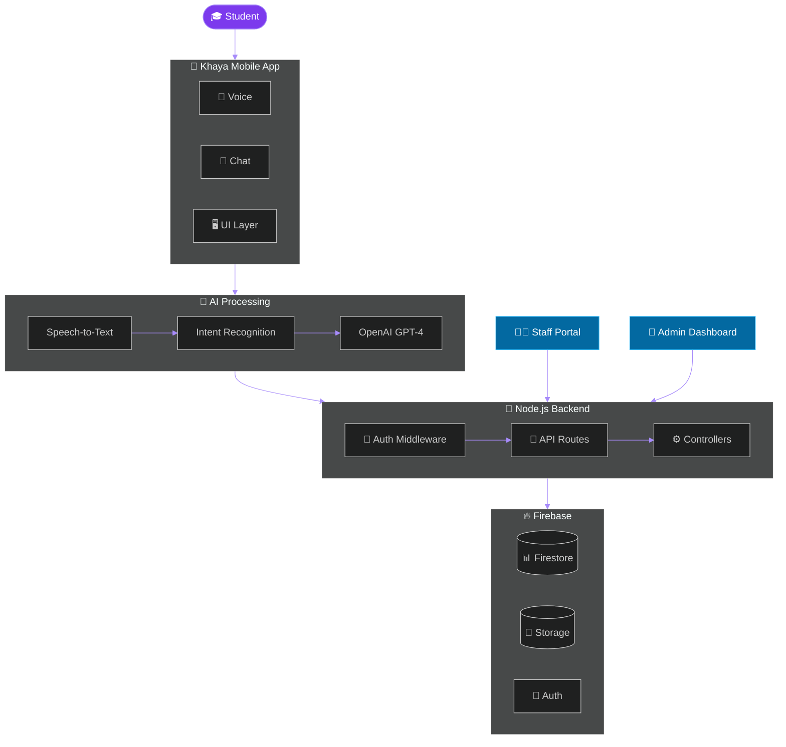

<div align="center">


</div>

<div align="center">


</div>

<br/>

<div align="center">


</div>

<br/>

<div align="center">

<!-- Animated skill icons -->


<br/><br/>

<!-- Glowing Badges Row 1 -->

&nbsp;

&nbsp;


<br/><br/>

<!-- Tech Badges Row 2 -->

&nbsp;

&nbsp;

&nbsp;

&nbsp;

&nbsp;


<br/><br/>

<!-- Social/Stats Badges -->
<a href="#"></a>
&nbsp;
<a href="#"></a>
&nbsp;
<a href="#"></a>
&nbsp;
<a href="#"></a>

</div>

<br/>

---

<div align="center">

## 🌊 What is Khaya?

</div>


**Khaya** *(isiZulu for "Home")* is an AI-powered mobile companion that transforms how university students interact with their campus residence.

No more paper forms. No more lost emails. No more missed announcements.

Just open Khaya, speak or type, and it's done.

```
"Hey Khaya, report a broken geyser in room 14B"
→ Maintenance request logged ✅
→ Staff notified instantly 🔔  
→ You get real-time updates 📲
```

> 💡 Built on the philosophy of **Ubuntu** — *"I am because we are"*

<br clear="right"/>

---

<div align="center">

## ⚡ Features at a Glance


</div>

<br/>

<table>
<tr>
<td width="50%" valign="top">

### 🗣️ AI Voice & Chat
```
🎤 Voice-First Design
🤖 GPT-Powered Understanding  
🌐 Multilingual Support
🕐 24/7 Availability
💡 Context-Aware Responses
```
Speak naturally to Khaya — no menus, no forms, just conversation. The AI understands your request, your room, your history, and acts immediately.

</td>
<td width="50%" valign="top">

### 🛠️ Smart Maintenance
```
⚡ Voice-to-Ticket in 10 Seconds
📸 Photo Attachments Supported
🔔 Real-Time Status Updates
🧠 Auto-fills Your Room Details
📊 Full Request History Log
```
From reporting to resolution — every step is tracked and communicated. No more wondering if anyone received your maintenance report.

</td>
</tr>
<tr>
<td width="50%" valign="top">

### 📢 Residence Hub
```
📣 Live Push Announcements
📘 Digital Rulebook On-Demand
📅 Event & Inspection Calendar
🚨 Emergency Alert System
🗂️ Categorised Notice Archive
```
Your residence's entire information ecosystem, accessible with a single tap or voice command.

</td>
<td width="50%" valign="top">

### 💬 Community & Comms
```
📩 Direct In-App Staff Chat
🤝 Roommate Coordination Tools
🏘️ Resident Community Board
🔒 Anonymous Feedback System
⭐ Rate Your Residence Services
```
Build real connections between students, staff, and management — all within one trusted platform.

</td>
</tr>
</table>

---

<div align="center">

## 🎯 The Problem We Solve

</div>

<div align="center">

```
╔══════════════════════════════════════════════════════════════════════╗
║                                                                      ║
║   😤  WITHOUT KHAYA          |      😊  WITH KHAYA                  ║
║  ────────────────────────────┼───────────────────────────────────    ║
║   Paper maintenance forms    │  Voice request in 10 seconds ✅       ║
║   Searching notice boards    │  Push notifications in real-time ✅   ║
║   Emailing staff for days    │  In-app chat with instant replies ✅  ║
║   Guessing repair status     │  Live tracking dashboard ✅           ║
║   Hunting for rulebooks      │  Ask Khaya anything, anytime ✅       ║
║   Missing critical alerts    │  Emergency notifications first ✅     ║
║                                                                      ║
╚══════════════════════════════════════════════════════════════════════╝
```

</div>

---

<div align="center">

## 📱 App Screenshots

</div>

<div align="center">

| 🏠 Dashboard | 💬 AI Chat | 🔧 Maintenance |
|:---:|:---:|:---:|
|  |  |  |

| 📢 Announcements | ⚙️ Settings | 👤 Profile |
|:---:|:---:|:---:|
|  |  |  |

</div>

---

<div align="center">

## 🏗️ System Architecture

</div>


```mermaid
%%{init: {'theme': 'dark', 'themeVariables': { 'primaryColor': '#7c3aed', 'primaryTextColor': '#fff', 'primaryBorderColor': '#a78bfa', 'lineColor': '#a78bfa', 'secondaryColor': '#1e1b4b', 'tertiaryColor': '#0f172a'}}}%%

flowchart TD
    U(["🎓 Student"]):::user --> APP

    subgraph APP["📱 Khaya Mobile App"]
        direction LR
        V["🎤 Voice"]
        C["💬 Chat"]
        UI["🖥️ UI Layer"]
    end

    APP --> AI

    subgraph AI["🧠 AI Processing"]
        STT["Speech-to-Text"]
        NLU["Intent Recognition"]
        GPT["OpenAI GPT-4"]
        STT --> NLU --> GPT
    end

    AI --> API

    subgraph API["🚀 Node.js Backend"]
        AUTH["🔐 Auth Middleware"]
        ROUTES["📡 API Routes"]
        CTRL["⚙️ Controllers"]
        AUTH --> ROUTES --> CTRL
    end

    API --> DB

    subgraph DB["🔥 Firebase"]
        FS[("📊 Firestore")]
        ST[("📁 Storage")]
        FK["🔑 Auth"]
    end

    STAFF["👨‍🏫 Staff Portal"]:::external --> API
    ADMIN["👑 Admin Dashboard"]:::external --> API

    classDef user fill:#7c3aed,stroke:#a78bfa,color:#fff
    classDef external fill:#0369a1,stroke:#38bdf8,color:#fff
```

---

<div align="center">

## 🚀 Quick Start


</div>

**Step 1 — Clone**
```bash
git clone https://github.com/your-username/khaya-app.git && cd khaya-app
```

**Step 2 — Install**
```bash
npm install && npm install -g expo-cli
```

**Step 3 — Configure Environment**
```bash
cp .env.example .env
```
```env
# ─── Firebase ─────────────────────────────────
FIREBASE_API_KEY=your_key_here
FIREBASE_AUTH_DOMAIN=yourproject.firebaseapp.com
FIREBASE_PROJECT_ID=your_project_id
FIREBASE_STORAGE_BUCKET=yourproject.appspot.com

# ─── AI Services ──────────────────────────────
OPENAI_API_KEY=your_openai_key
DIALOGFLOW_PROJECT_ID=your_dialogflow_id

# ─── Backend ──────────────────────────────────
API_BASE_URL=http://localhost:3000
```

**Step 4 — Launch 🚀**
```bash
npx expo start
# Press 'i' for iOS  |  'a' for Android  |  'w' for Web
```

---

<div align="center">

## 📁 Project Structure

</div>

```
khaya-app/
│
├── 📱 app/                         # Expo Router (file-based navigation)
│   ├── (auth)/                     # 🔐 Login, Register, Onboarding
│   ├── (tabs)/                     # 🗂️ Main Tab Screens
│   │   ├── dashboard.tsx           #    🏠 Home Dashboard
│   │   ├── chat.tsx                #    💬 AI Chat Interface
│   │   ├── maintenance.tsx         #    🔧 Maintenance Portal
│   │   ├── announcements.tsx       #    📢 Announcements Feed
│   │   └── profile.tsx             #    👤 User Profile
│   └── _layout.tsx                 # Root layout & navigation
│
├── 🧩 components/                  # Reusable UI Components
│   ├── ChatBubble.tsx
│   ├── MaintenanceCard.tsx
│   ├── VoiceButton.tsx
│   └── AnnouncementBanner.tsx
│
├── 🧠 services/                    # Business Logic & API Layers
│   ├── ai/
│   │   ├── openai.ts               #    GPT integration
│   │   └── speechRecognition.ts    #    Voice processing
│   └── firebase/
│       ├── auth.ts
│       ├── firestore.ts
│       └── storage.ts
│
├── 🎨 constants/                   # Design Tokens
│   ├── Colors.ts
│   └── Typography.ts
│
├── 🔧 backend/                     # Node.js Express API
│   ├── routes/
│   ├── controllers/
│   └── server.ts
│
└── 📦 package.json
```

---

<div align="center">

## 🛣️ Roadmap

</div>

```
Phase 1 — Core Foundation                                  ████████████ 100%
  ✅ AI chat & voice interface
  ✅ Maintenance request system  
  ✅ Firebase auth & database
  ✅ Announcement hub

Phase 2 — Community Features                               ██████░░░░░░  50%
  🔄 Roommate coordination tools
  🔄 Anonymous feedback system
  🔄 Community notice board
  🔄 Direct staff messaging

Phase 3 — Intelligence Layer                               ░░░░░░░░░░░░   0%
  🔮 Predictive maintenance alerts
  🔮 Sentiment analysis on feedback
  🔮 Smart scheduling assistant
  🔮 Personalised announcement feed

Phase 4 — Expansion                                        ░░░░░░░░░░░░   0%
  🌟 Multi-campus support
  🌟 University SIS integration
  🌟 Offline-first capabilities
  🌟 AR room navigation
```

---

<div align="center">

## 🤝 Contributing


</div>

```bash
# 1. Fork the repo on GitHub, then:
git clone https://github.com/YOUR-USERNAME/khaya-app.git

# 2. Create your feature branch
git checkout -b feature/your-feature-name

# 3. Make your changes & commit
git commit -m "feat: describe your feature clearly"

# 4. Push and open a Pull Request
git push origin feature/your-feature-name
```

> Please read [CONTRIBUTING.md](CONTRIBUTING.md) and follow our [Code of Conduct](CODE_OF_CONDUCT.md) 💜

---

<div align="center">

## 🙏 Acknowledgements

| Tool | Purpose |
|:---:|:---:|
| 🔥 Firebase | Backend & real-time database |
| 🤖 OpenAI GPT-4 | AI language processing |
| ⚡ Expo | React Native dev platform |
| 🎤 Dialogflow | Natural language understanding |
| 🌐 Capsule-Render | Animated README banners |
| 💻 Skill Icons | Tech stack icons |

<br/>

*Built on the spirit of **Ubuntu** — "I am because we are"* 🌍

</div>

---

<div align="center">


<br/>

<a href="https://github.com/your-username/khaya-app">
  
</a>

<br/><br/>


</div>
