# 🎓 Khaya - Your Smart Campus Assistant

<div align="center">


**"Home" in isiZulu • Your AI-powered campus living companion**

<div align="center">


</div>

[](#-features)
[](#-demo)
[](#-quick-start)

</div>

## 🌟 Transform Your Campus Living Experience

Khaya is the intelligent assistant that makes student accommodation life seamless, efficient, and stress-free. No more lost maintenance forms, confusing residence rules, or missed announcements - just natural conversations with your AI residence companion.

<div align="center">

### 🎯 The Problem We Solve

> *"I wish there was an easier way to report issues without filling out forms..."*  
> *"When's the next residence meeting again?"*  
> *"How do I contact maintenance urgently?"*

**Khaya answers all these - through simple chat or voice commands.**

</div>
## 📱 App Architecture

```mermaid
graph TD
    A[🎓 Student User] --> B[📱 Khaya Mobile App]
    B --> C[🗣️ Voice Input]
    B --> D[💬 Chat Interface]
    B --> E[📱 UI Components]
    
    C --> F[🎤 Speech Recognition]
    D --> F
    F --> G[🤖 AI Processing]
    
    G --> H[🚀 Backend API]
    H --> I[🔥 Firebase Services]
    
    I --> J[📊 Firestore DB]
    I --> K[🔐 Auth]
    I --> L[📁 Storage]
    
    H --> M[🧠 AI Services]
    M --> N[OpenAI GPT]
    M --> O[Dialogflow]
    
    P[👨‍🏫 Staff Portal] --> H
    Q[👑 Admin Dashboard] --> H
    
    style A fill:#e1f5fe
    style B fill:#f3e5f5
    style H fill:#fff3e0
    style I fill:#ffebee
```



## ✨ Features

### 🗣️ AI Voice & Chat Assistant
- **Natural Conversations**: "Hey Khaya, report a broken light in room 12"
- **Voice-First Design**: Speak naturally instead of filling forms
- **24/7 Availability**: Get help anytime, even during late study sessions
- **Multilingual Support**: Communicate in your preferred language

### 🛠️ Smart Maintenance
- **Instant Reporting**: Voice-to-request in seconds
- **Status Tracking**: Real-time updates on your repairs
- **Automatic Details**: Knows your room number and history
- **Photo Attachments**: Visual context for maintenance teams

### 📢 Residence Hub
- **Live Announcements**: Never miss important updates
- **Digital Rulebook**: "Khaya, what's the guest policy?"
- **Event Calendar**: Social events, inspections, deadlines
- **Emergency Alerts**: Instant critical notifications

### 💬 Communication
- **Direct Staff Chat**: No more lost emails
- **Roommate Coordination**: Shared lists and schedules
- **Community Board**: Connect with fellow residents
- **Anonymous Feedback**: Share concerns privately

## 🎥 Demo

<div align="center">

### App Screenshots

| Dashboard | Chat Interface | Maintenance | Announcements |
|-----------|----------------|-------------|---------------|
|  |  |  |  |

| Settings | Profile |
|----------|---------|
|  |  |

</div>

## 🚀 Quick Start

### Prerequisites
- Node.js 16+ installed
- Expo CLI installed globally
- iOS/Android simulator or physical device

### Installation

```bash
# Clone the repository
git clone https://github.com/your-username/khaya-app.git
cd khaya-app

# Install dependencies
npm install

# Install Expo CLI globally (if not already installed)
npm install -g expo-cli

# Start the development server
npx expo start
